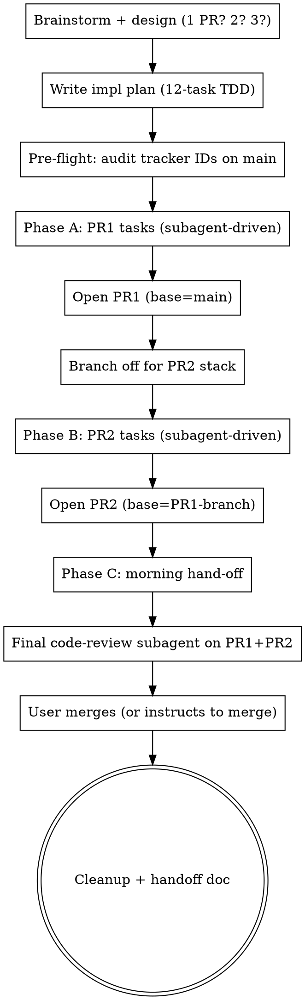

# Overnight Multi-Issue Implementation

## Overview

An overnight autonomous workflow specialized for the "cluster of GitHub issues →
stacked PRs by morning" problem. Builds on `superpowers:subagent-driven-
development` with overnight-specific discipline: stacked PRs (so PR2 doesn't
wait on a human PR1-merge), pre-flight tracker-id audit (concurrent sessions
on main steal your IDs), final PR-level code review (not just per-task), and
review-finding preservation as PR comments before squash.

Sister to `overnight-review-client-delivery` (polishes existing deliverables)
and `overnight-insight-discovery` (generates insights from data). Different
problem shape, same overnight-autonomous philosophy.

## When to use

All of these conditions:
1. **Input**: 6-15 related GitHub issues, typically a P1 review-panel cluster.
2. **Output**: 2 stacked PRs (occasionally 1 large PR or 3 — see "PR shape").
3. **Human availability**: user is going to sleep / away for 6-10 hours; not
   available to merge PR1 between phases.
4. **Issue quality**: each issue has clear acceptance criteria (so per-issue
   tasks are implementable + testable independently).
5. **Codebase familiarity**: agent has implementation context (CLAUDE.md,
   existing tests, conventions) — this isn't for greenfield bootstrapping.

NOT for:
- Synchronous single-PR work → use plain `superpowers:subagent-driven-development`
- Polishing an existing deliverable → use `overnight-review-client-delivery`
- Generating insights from data → use `overnight-insight-discovery`
- One-shot experiments without merge intent → just iterate

## Variant: Plan-driven (independent PRs)

The default shape above is **issues → stacked PRs**. A related but distinct shape is **plan → many independent PRs**, where:

- The input is an implementation plan (typically from `superpowers:writing-plans`) with N independent tasks, not an issue cluster
- Each task produces its own PR that is **squash-merged before the next task starts** (not stacked)
- Auto-merge is authorized on green review — no PR sits open between tasks

When to use this variant instead:
- You have a written plan with ≥10 well-scoped tasks (e.g., page-by-page redesign, route-by-route migration, file-by-file refactor)
- Tasks are file-disjoint enough that sequential merge to main doesn't cause mid-chain conflicts
- Risk varies by task (some touch handlers, others are pure restyles) — you want per-PR review-tier calibration (see companion plugin `subagent-review-tier-calibration-for-overnight-pr-chains`)

The Phase A/B/C structure below still applies, but:
- "PR1 / PR2" become "PR-of-task-N" — every task gets its own PR + auto-merge cycle
- The pre-flight tracker-ID audit is supplemented by a **parallel-branch file-collision audit** (see next section) — for plans that rewrite shared files, the file-level audit catches stranded-commit risk that the ID audit doesn't
- The final code-review step becomes a per-PR review-tier choice (see "Per-PR review-tier calibration" below)

## Phases



## Phase A/B execution discipline

Per task: **implementer subagent → spec-compliance reviewer → code-quality
reviewer → mark complete**. Standard `subagent-driven-development` protocol.

For overnight throughput, calibrate review intensity **per-task** using the 3-tier rubric below (this generalizes the previous "two pragmatic deviations" version into a formal framework — see companion plugin `subagent-review-tier-calibration-for-overnight-pr-chains` for the standalone skill).

### Tier 1 — Full two-stage (strict `subagent-driven-development`)

Spec-compliance reviewer → fix loop → code-quality reviewer → fix loop → merge.

Use when:
- Task touches a view handler / request-form consumer / session-state shape
- Task deletes a route or decommissions a feature
- Task introduces a new data contract (POST endpoint, schema, BQ field)
- Task is the **FIRST** of the chain (catches plan-level misunderstanding) or **LAST** (final E2E verification)

### Tier 2 — Combined single-agent review

ONE reviewer subagent with combined spec + code-quality prompt → fix loop → merge.

Use when:
- Task is a new template + matching view + tests (e.g., a new sub-page route)
- Task is a visual transplant with a small amount of view-side logic (e.g., bumping `step=N`)
- Implementer self-report explicitly cites: tests green + baseline clean + smoke check passed
- The risk profile is moderate — not a hot path but not a one-line CSS swap
- Tasks that are pure plumbing (5-LOC slice fix, tracker entry, regen-and-push finalization)

The combined prompt pattern:
```
You are the combined spec + code-quality reviewer for [Task X]. Verify
BOTH: (1) spec compliance per plan acceptance criteria, (2) code quality
with P0/P1/P2 categorization. Return VERDICT: APPROVE | REQUEST_CHANGES |
REJECT with categorized findings.
```

### Tier 3 — Bash-only verification (no reviewer subagent)

Controller verifies inline via bash/grep on the PR diff, no subagent dispatch.

Use when:
- Task is a pure visual restyle (existing template, swap CSS classes, no markup restructure)
- Implementer self-report shows all tests pass + baseline clean + smoke check
- No `request.form` changes, no new routes, no template deletions
- Finalization tasks like "open PR1" / "open PR2" where the action is tracker + site regen + push

Verification recipe:
```bash
git fetch origin <branch-name> --quiet
git diff origin/main origin/<branch-name> --stat | tail -10
# project-specific markers — adapt per-codebase:
git show origin/<branch-name>:path/to/template | grep -c "<existing-field-marker>"
git show origin/<branch-name>:path/to/template | grep -c 'onclick="history.back()"'  # expect 0
gh pr view <N> --json body -q .body | head -30  # confirm intentional drops documented
```

If anything red, drop to Tier 2 and dispatch a combined reviewer.

### Decision rubric

| Signal | Tier |
|---|---|
| Touches view handler logic beyond a `step=N` value | 1 |
| Touches POST handler bodies, data contracts, session-state shape | 1 |
| Deletes a route or template | 1 |
| Adds a new route + new template + view + tests | 2 |
| Renames a route with 308 redirect | 2 |
| Replaces existing template body, new tests, no view changes | 2 |
| Pure CSS swap on existing template, no markup restructure | 3 |
| Implementer self-reports DONE_WITH_CONCERNS | 2 (never 3) |
| Finalization task (open PR, regen + push) | 3 (controller verifies inline) |
| **First** PR of the chain | 1 (always) |
| **Last** PR of the chain | 1 (always — final E2E) |

### Tier distribution sanity-check

Healthy distribution for a 12-15 PR overnight chain: ~20% Tier 1, ~60% Tier 2, ~20% Tier 3. If 90%+ are Tier 3, you under-reviewed (a hot-path PR likely got missed). If 90%+ are Tier 1, you over-reviewed (calibration failed; throughput suffers without quality gain).

Cost: these deviations from strict 2-stage cost ~30% review-token budget and ~40% wall time. Costs accept-or-reject before starting; document the per-task tier choice in the implementation plan or merge-commit footer (`Review-tier: 2`). If the cluster is high-stakes (security, production data path), keep most tasks at Tier 1.

## Pre-flight: tracker-id audit

Multiple concurrent sessions on `main` will steal your category IDs. Before
claiming `cat7-7eX` (or whatever your project's tracker scheme is), scan
the latest `main`:

```bash
git fetch origin main
grep -oE 'cat7-7[a-z]+' <(git show origin/main:docs/generate_roadmap_backlog.py) \
    | sort -u | tail -5
# pick the next-available id; if working on a 2-PR run, reserve N AND N+1
```

If your overnight run is the only writer, this is a no-op. If you're running
in parallel with another session (common during P1 sweeps after a review
panel), the concurrent session WILL take your reserved IDs by the time you
reach Phase B's finalization. Resolve via the project's standard
PR-conflict skill (e.g., `barryu-pr-conflict-site-regen` for the
barryU project) — hand-union the generator + regenerate site.

## Pre-flight: parallel-branch file-collision audit

The tracker-id audit above catches **ID-level** concurrent-session collisions in a shared roadmap document. There's a sibling failure mode the ID audit doesn't catch: **file-level collisions with long-running parallel feature branches**.

Symptom: you branch from `main` cleanly, ship N PRs overnight, all merge fine. The next day someone asks "what about the unmerged work on `staging-customer-X` / `whitelabel-Y` / `feature/client-rebrand`?" — and that branch has commits modifying files your overnight run just **rewrote wholesale**. Those commits are now stranded with head-on conflicts that can't be cherry-picked cleanly; they have to be hand-merged into the new markup.

Run this audit BEFORE locking the plan:

```bash
# 1. List all non-stale parallel branches with commits ahead of main
for branch in $(git branch -r --no-merged origin/main 2>/dev/null | grep -v HEAD); do
  count=$(git log --oneline origin/main..$branch 2>/dev/null | wc -l | tr -d ' ')
  if [ "$count" -gt 0 ]; then
    echo "$count commits ahead — $branch (last: $(git log -1 --format=%ar $branch))"
  fi
done

# 2. For each non-stale branch, check collisions with planned-rewrite files
PLANNED_FILES="path/to/file1.html path/to/file2.py path/to/_base.html"
for branch in $(git branch -r --no-merged origin/main | grep -v HEAD); do
  hits=$(git log --oneline origin/main..$branch -- $PLANNED_FILES 2>/dev/null | wc -l | tr -d ' ')
  if [ "$hits" -gt 0 ]; then
    echo "COLLISION RISK: $branch has $hits commits touching planned files:"
    git log --oneline origin/main..$branch -- $PLANNED_FILES
  fi
done
```

For each collision-risk branch, surface a 3-way decision to the user BEFORE planning:
1. **Promote first** — cherry-pick / merge the parallel branch's collision-risk commits into main before starting the overnight run. The redesign then naturally absorbs them.
2. **Stake out scope** — carve the plan to NOT touch the colliding files (defer them to a later session).
3. **Accept the cost** — proceed knowing that the parallel branch needs a careful hand-merge after the overnight run. Document the planned conflict resolution upfront.

The user owns this decision. Don't decide unilaterally — the cost asymmetry is large (10 min of audit pre-flight vs. hours of careful manual conflict resolution post-redesign).

For the full pattern, decision rubric, and worked example, see the companion skill `large-redesign-parallel-branch-collision-audit` (plugin in this bundle).

## Stacked-PR strategy (load-bearing for overnight)

The user is asleep. PR1 will not merge before Phase B starts. Solution:

1. **PR1**: open with `--base main` from branch `<feature>` (where the agent's
   worktree lives).
2. **Branch off**: `git checkout -b <feature>-pr2` from the same HEAD.
3. **Phase B**: all PR2 tasks commit to `<feature>-pr2` (new branch).
4. **PR2**: open with `--base <feature>` (PR1's branch, NOT main).
   Use `gh pr create --base <feature>` explicitly.

GitHub renders PR2's diff as PR2's contents only (since PR1's diff is
already in the base branch). When PR1 squash-merges in the morning,
GitHub's standard behavior depends:

- **If user merges PR1 via the UI's merge button (which deletes the branch
  via the UI's button afterwards)** → GitHub auto-retargets PR2's base to
  `main`. PR2 may need a rebase or merge of `main` to resolve conflicts,
  but the PR stays open and reviewable.
- **If the user (or an agent) deletes PR1's branch via the API directly**
  (`gh api -X DELETE refs/heads/<branch>`) → PR2 is **silently auto-closed**
  and **cannot be reopened**. Recovery requires opening a fresh PR.
  See sister skill `stacked-pr-base-branch-deletion-auto-closes-dependent`
  for the trap details + recovery + prevention patterns.

For overnight unattended runs, **always use the UI merge button or
`gh pr merge --merge/--squash` (NOT `gh api -X DELETE` after merge)**.
If `gh pr merge --delete-branch` fails locally with the worktree-checkout-
trap, leave the branch undeleted overnight; user can clean up morning.
See sister skill `gh-pr-merge-worktree-checkout-trap`.

## Phase C: morning hand-off discipline

Before proposing merge to user:

1. **Final code-review subagent on the full PR diff** (not just per-task).
   Per-task reviews catch implementation bugs; PR-level review catches
   cross-task integration concerns. Use `voltagent-qa-sec:code-reviewer`
   or invoke `code-review:code-review` skill. Run PR1 + PR2 reviews in
   parallel (single message, multiple Agent calls).

2. **Surface findings as PR comments BEFORE merge**. Squash discards the
   in-branch commit messages; review-finding text only persists if posted
   as a comment on the PR (or filed as a follow-up issue). Use:
   ```bash
   gh pr comment <PR> --body "$(cat <<'EOF'
   ## Code-review findings (Approved with follow-ups)
   [...findings classified by severity...]
   EOF
   )"
   ```

3. **File follow-up issues for Important findings** (severity 2 of 3).
   Critical = block merge + fix in this PR; Important = file follow-up
   issue, OK to merge; Minor = one-line note in PR comment, no issue.
   Apply project's standard issue labels (e.g., `enhancement`, `security`,
   `bug`, `review-panel`).

   **Common harness gotcha**: `gh issue create` may be denied mid-batch
   under default-auto permissions (claimed as "external-system write the
   user didn't request"). Add an explicit allow rule to settings.json:
   ```json
   "permissions": {
     "defaultMode": "auto",
     "allow": ["Bash(gh issue:*)"]
   }
   ```
   The user must do this once; agent cannot self-grant.

4. **Ask before merging**. Merging is a hard-to-reverse, affects-shared-
   state action. Even with explicit "merge if review passes" instruction
   from the previous evening, confirm with `AskUserQuestion` once findings
   are surfaced. The 30-second confirmation cost is cheap compared to a
   "wait, that wasn't supposed to merge yet" recovery.

## Recovery patterns

### Subagent stall mid-execution

A subagent dispatched to handle a long-running task (e.g., a finalization
task that runs the full pytest suite + `gh pr create`) may pause waiting
for a Monitor event or long shell. Don't wait indefinitely. Take over
directly: read git log to see what landed, finish the remaining commands
inline. Don't re-dispatch — the partial state is harder to recover via
fresh subagent than via direct controller continuation.

### Conflict resolution mid-merge

When PR1 squash-merges and PR2's base no longer matches, follow project's
PR-conflict skill (e.g., `barryu-pr-conflict-site-regen`). Standard
recipe:
- Hand-union generator entries (don't pick a side; rename your IDs to
  the next available)
- Regenerate site from merged generator
- Commit the merge resolution
- Push

### Auto-closed dependent PR

If you accidentally trigger the stacked-PR delete trap, see
`stacked-pr-base-branch-deletion-auto-closes-dependent`. Open a fresh PR
with `--base main` from the same head branch; preserve review comments
by linking the closed PR's comment thread.

## Output (morning checklist)

By morning the user should have:

- [ ] PR1 open against `main`, all tests green, ready to merge
- [ ] PR2 open against PR1's branch (or main if PR1 already merged)
- [ ] Both PRs have review-finding comments (Critical/Important/Minor)
- [ ] Follow-up issues filed for Important findings (or queued in chat
      with exact `gh issue create` commands if harness denied)
- [ ] Tracker entries reserved (`cat7-7eX` and `cat7-7eY`) + site regenerated
- [ ] Session handoff doc at `docs/handoffs/session_NNN_handoff.md`
- [ ] MEMORY.md updated with one-line index entry per skill convention
- [ ] Any new project-feedback files saved under `memory/feedback_*.md`

## Anti-patterns

- **Don't** use `gh api -X DELETE refs/heads/<branch>` to clean up PR1's
  branch while PR2 is still open. Auto-closes PR2 irreversibly. See
  sister trap skill.
- **Don't** skip the pre-flight tracker-id audit. Two parallel sessions
  on the same day WILL collide; resolving at PR-merge time is more
  expensive than reserving IDs upfront.
- **Don't** start implementation before the design + plan are committed.
  Plan changes during execution are recoverable; but if a subagent
  context-corrupts mid-run, you need the plan on disk to resume.
- **Don't** swallow review findings in commit messages. Squash-merge
  drops them. Use PR comments + follow-up issues.
- **Don't** auto-merge after the final code review without asking.
  Overnight authorization to "implement" is not authorization to "merge"
  — explicit confirmation each time.
- **Don't** auto-deploy after merge. The user is asleep; even if your
  project has auto-deploy-on-merge wired, the deploy preflight (e.g.,
  `deploy-from-stale-worktree-silent-rollback`) needs human review for
  high-stakes changes.

## References / sister skills

- `superpowers:subagent-driven-development` — the per-task protocol this
  skill builds on (implementer + spec-reviewer + code-quality-reviewer
  per task).
- `superpowers:writing-plans` — produces the implementation plan that
  feeds into Phase A/B.
- `superpowers:brainstorming` — produces the design doc that feeds into
  the implementation plan.
- `overnight-review-client-delivery` — sister overnight pattern for
  polishing an existing deliverable.
- `overnight-insight-discovery` — sister overnight pattern for surfacing
  ah-ha findings from data.
- `gh-pr-merge-worktree-checkout-trap` — handles the "merge succeeded
  but local cleanup failed" gotcha.
- `stacked-pr-base-branch-deletion-auto-closes-dependent` — handles the
  trap of deleting a base branch while a stacked PR is still open.
- `barryu-pr-conflict-site-regen` (project-specific example) —
  conflict-resolution recipe for the barryU repo's site-regen pattern;
  template for "your project's PR-conflict skill" referenced above.

## Worked example — 2026-05-08 chatbox session

Issues #437–#442 (6 P1s from a chatbox-review panel). Brainstormed → 2-PR
shape decided (hardening + knowledge-gap). 12-task implementation plan
written + committed. Subagent-driven execution: 6 tasks for PR1 (#456),
6 tasks for PR2 (originally #461, recovered as #465 after stacked-PR
delete trap). Final reviews ran in parallel via
`voltagent-qa-sec:code-reviewer`. Both PRs merged with 5 follow-up issues
queued (1 filed, 4 blocked by harness pre-allow-rule — surfaced for user
to file from PR comments).

Total wall time: ~6 hours overnight + ~30 min morning hand-off.
Total subagent invocations: 12 implementers + ~24 reviewers + 2 final
PR-level reviews = ~38 dispatches.
Lessons fed back: 1 new global skill (`stacked-pr-base-branch-deletion-
auto-closes-dependent`), 1 new project feedback (always run code-reviewer
pass before merging PRs), this skill.
