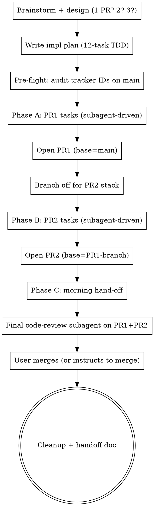

# Overnight Multi-Issue Implementation

## Overview

This skill has two input shapes:

1. **Issue cluster:** related GitHub issues become stacked PRs by morning.
2. **Large mixed queue:** every source row is reconciled first, then its
   authorized slices move through dependency waves and serial integration.

Both shapes add overnight-specific discipline to implementation: isolated
writers, shared-file ownership, current-target checks, recoverable state,
final integrated-diff review, and honest blocked or unchecked outcomes. The
issue-cluster path also carries the pre-flight tracker-ID audit and preserves
review findings as PR comments before squash when those external writes are
authorized.

Sister to `overnight-review-client-delivery` (polishes existing deliverables)
and `overnight-insight-discovery` (generates insights from data). Different
problem shape, same overnight-autonomous philosophy.

Two real runs back this skill, and both are written up at the end. Passages
below that say **"the observed run"** or "the observed night" mean the larger
2026-08-05 run. Its surviving handoff does not verify exact agent or workflow
counts, so this skill does not repeat them. The 2026-05-08 chatbox session is
the smaller run the skill was first extracted from.

## When to use

Choose one input shape:

- **Issue cluster:** 6–15 related issues, normally with clear acceptance
  criteria, that naturally form two stacked PRs (occasionally one or three).
- **Large mixed queue:** a live index, tracker, handoff directory, or backlog
  with roughly 15 or more rows whose current states and file claims must be
  proved before dispatch. Read the large-queue reference named below.

Both require an unattended time window, enough repository context to verify
current state, explicit limits on external actions, reviewable units, and a
durable recovery record. This is not greenfield bootstrapping.

NOT for:
- Synchronous single-PR work → use plain `superpowers:subagent-driven-development`
- Polishing an existing deliverable → use `overnight-review-client-delivery`
- Generating insights from data → use `overnight-insight-discovery`
- One-shot experiments without merge intent → just iterate

## Variant: large mixed live queue

When the source is a live index, tracker, handoff directory, or backlog with
roughly 15 or more mixed rows, do not force it into the two-stacked-PR shape.
Read [`references/large-live-queue-orchestration.md`](references/large-live-queue-orchestration.md)
before classification or dispatch. That procedure adds mechanical coverage
proof, split classifications, granular authority, per-item budgets and file
claims, a durable state schema, serial integration, immutable base/head review,
and an adversarial plan preflight.

The authority section immediately below applies to both input shapes. After
recording those grants, the large-queue reference is the complete procedure for
that shape, including its closeout checklist. A large queue does **not** continue
into the issue-cluster Phase 0, Phase A/B/C graph, stacked-PR procedure,
tracker-ID examples, issue-comment workflow, or issue-cluster morning checklist
below.

## Authority before any command

Record the grants for network access, branch and commit, push, PR comments,
issue writes, merge, deploy, paid calls, generation, and external repositories
before running commands that exercise them. Every network or shared-state
command later in this skill is conditional on its matching grant, even when a
worked example uses imperative wording. Without fetch authority, freshness is
`UNCHECKED` and execution or merge must stop; without push or PR authority,
review an immutable local commit and report the remaining action.

## Issue-cluster procedure

The remainder of this file applies to the issue-cluster input shape. Large
mixed queues use the reference above instead.

### Phase 0: backlog triage + owner-ruling application (when issues are NOT pre-validated)

The issue-cluster path normally assumes each issue is live and well-specified. When the input is
instead a **backlog** — dozens of issues filed over weeks, some possibly already fixed by
intervening PRs, some obsolete — running the overnight build directly either re-does merged
work or (worse) silently drops still-live issues. Insert a decision layer first. In practice
the triage routinely flips wrong "already fixed" verdicts back to live — that is the
dismissal-bias rule earning its keep.

1. **Triage against live `main`, biased AGAINST dismissal.** Pin to `origin/main` (not your
   worktree); one read-only investigator per issue; verdicts `still_valid | partially_done |
   already_fixed | outdated_superseded | needs_owner_input`. A dismissal verdict requires BOTH
   the merged PR number that did the work AND a current `file:line` proving it — otherwise
   default to `still_valid`. Adversarially re-verify ONLY the dismissals (a wrong "still valid"
   is cheap — caught at implementation; a wrong "already fixed" silently drops real work).
2. **Present a cut line — never auto-close.** The owner ratifies per item: close / build /
   defer / discuss. An interactive per-item review page beats chat retyping — see
   [`interactive-feedback-report`](https://github.com/wan-huiyan/interactive-feedback-report),
   which collects the rulings and emits them as one structured paste-back prompt.
3. **Bake rulings into the issues BEFORE building.** One comment per ruled issue under a fixed,
   greppable header (e.g. `Owner ruling — <date> backlog review`). Rulings become **repo state,
   not conversation state** — the overnight build then reads authoritative specs from issue
   comments, never from a chat transcript that may be gone by morning.
4. **Split decision-application from build execution.** Apply closures / ruling comments /
   re-scopes in the decision session (cheap, minutes); hand the builds to a fresh session via a
   **wave-ordered kickoff prompt** (quick unblocked items → standard builds → large sequenced
   work) that lists "already done — do NOT redo" up top and points at the issue comments as the
   specs. The kickoff prompt feeds this skill's Phase A/B directly. Before each build, re-verify
   the issue's premise on current `main` — parallel sessions move fast.
5. **Rulings arrive in ROUNDS.** The first cut-line reply rarely settles every open ask; later
   answers use the SAME comment header plus a "(follow-up round)" suffix, and the kickoff prompt
   is amended **additively** (append new wave items; strike through resolved "awaiting owner"
   entries — never rewrite sections an executing session may already have read).
6. **Two sequencing rules that prevent orphaned work:** (a) when a ruling says "close X as
   absorbed and raise a successor", file the successor FIRST so X's closure comment cites the
   real issue number; (b) when a ruling answers an ask whose remaining work is a build, re-scope
   the issue in the ruling comment and keep it OPEN pointing at its wave item — closing it
   orphans the build (and beware the close-keyword trap below, which can do this silently).

## Variant: Plan-driven (independent PRs)

The default shape above is **issues → stacked PRs**. A related but distinct shape is **plan → many independent PRs**, where:

- The input is an implementation plan (typically from `superpowers:writing-plans`) with N independent tasks, not an issue cluster
- Each task produces its own PR that is **squash-merged before the next task starts** (not stacked)
- Auto-merge is authorized on green review — no PR sits open between tasks

When to use this variant instead:
- You have a written plan with ≥10 well-scoped tasks (e.g., page-by-page redesign, route-by-route migration, file-by-file refactor)
- Tasks are file-disjoint enough that sequential merge to main doesn't cause mid-chain conflicts
- Risk varies by task (some touch handlers, others are pure restyles) — you want per-PR review-tier calibration (see companion plugin `subagent-review-tier-calibration-for-overnight-pr-chains`)

The Phase A/B/C structure below still applies, but:
- "PR1 / PR2" become "PR-of-task-N" — every task gets its own PR + auto-merge cycle
- The pre-flight tracker-ID audit is supplemented by a **parallel-branch file-collision audit** (see next section) — for plans that rewrite shared files, the file-level audit catches stranded-commit risk that the ID audit doesn't
- The final code-review step becomes a per-PR review-tier choice (see "Per-PR review-tier calibration" below)

**Shared-file, independently-shippable tasks (a common middle case).** "File-disjoint" (above) is the easy case. But tasks can share a file and still each be independently shippable — e.g. three polish PRs that each touch different regions of the same `report.html`. These are NOT candidates for parallel branches (they'd conflict) and they don't need *stacking* either. Run them **strictly sequentially with a resync between each**:

```bash
# after PR-of-task-N squash-merges:
git fetch origin main --prune
git worktree add ../task-N+1 -b feat/task-N+1 origin/main
```

Bucket the plan's tasks by file overlap up front: file-disjoint sets may
parallelize; same-file sets become an ordered sequence, and every subsequent
task starts from the newly fetched `origin/main` in its own worktree. Do not
reset an unknown working tree. Starting task N+1 from task N's stale base is
how it silently reverts task N (see
`stale-base-pr-silently-reverts-upstream-content`).

## Phases



## Phase A/B execution discipline

Per task: **implementer subagent → spec-compliance reviewer → code-quality
reviewer → mark complete**. Standard `subagent-driven-development` protocol.

For overnight throughput, calibrate review intensity **per-task** using the 3-tier rubric below (this generalizes the previous "two pragmatic deviations" version into a formal framework — see companion plugin `subagent-review-tier-calibration-for-overnight-pr-chains` for the standalone skill). Whichever tier a task lands in, the reviewer's findings must reach the actor intact — the rule immediately below holds at every tier.

### Never truncate a findings payload — the reviews happen, the fixes don't

The reviewer's output is the only thing standing between a bad change and `main`. If your
orchestration hands it onward as a **sliced string**, findings die silently and every visible signal
still says the gate worked.

Observed: three reviewers returned **six** critical findings; the merging agent received
`JSON.stringify(reviews).slice(0, 9000)` and **five arrived**. The sixth was cut mid-object. It was
the worst of the six — a keep-or-kill decision resting on a margin about five times finer than the
data could resolve, in a pre-registration that had no power statement anywhere. Three
reviewers dispatched, three verdicts returned, findings commented on the PR, PR merged. Nothing
looked wrong.

**Rules:**

- **Never `.slice()` a findings list, verdict, or review payload.** Truncate self-reports and prose
  if you must; never the artifact whose entire purpose is to block an action.
- **Make the actor count.** Require the merging agent to report how many findings it *received*
  against how many it *answered*, and treat a mismatch as blocking. The only reason the loss above
  was recoverable is that the agent **noticed the payload was cut and said so** instead of
  proceeding quietly. Put that instruction in the prompt in those words.
- **The journal is the recovery path.** A workflow journal (`journal.jsonl`, one
  `{"type":"result"}` line per agent) holds each agent's true return value even when the
  orchestrator's own view was truncated. Parse it and diff against what was acted on.

Same family as a green suite that executed zero tests: the machinery reports success over an empty
set. See sister skill `overnight-review-panel-blocked-reviewer-reads-as-clean` — that one is a
reviewer that could not see; this one is a reviewer that saw and could not be heard.

### Tier 1 — Full two-stage (strict `subagent-driven-development`)

Spec-compliance reviewer → fix loop → code-quality reviewer → fix loop → merge.

> **Standing convention (the heavyweight tier):** for any non-trivial PR, prefer
> the **`roundtable:agent-review-panel`** skill (all panel agents `model: opus`)
> over the two-stage single-reviewer pair — multiple independent opus reviewers
> catch what one misses (see Phase C step 1). The single-reviewer tiers below
> (Tier 2 / Tier 3) are for the trivial / low-risk PRs that "skip the full panel."

Use when:
- Task touches a view handler / request-form consumer / session-state shape
- Task deletes a route or decommissions a feature
- Task introduces a new data contract (POST endpoint, schema, BQ field)
- Task is the **FIRST** of the chain (catches plan-level misunderstanding) or **LAST** (final E2E verification)

### Tier 2 — Combined single-agent review

ONE reviewer subagent with combined spec + code-quality prompt → fix loop → merge.

Use when:
- Task is a new template + matching view + tests (e.g., a new sub-page route)
- Task is a visual transplant with a small amount of view-side logic (e.g., bumping `step=N`)
- Implementer self-report explicitly cites: tests green + baseline clean + smoke check passed
- The risk profile is moderate — not a hot path but not a one-line CSS swap
- Tasks that are pure plumbing (5-LOC slice fix, tracker entry, regen-and-push finalization)

The combined prompt pattern:
```
You are the combined spec + code-quality reviewer for [Task X]. Verify
BOTH: (1) spec compliance per plan acceptance criteria, (2) code quality
with P0/P1/P2 categorization. Return VERDICT: APPROVE | REQUEST_CHANGES |
REJECT with categorized findings.
```

**Put this line in every reviewer prompt, verbatim — Tier 1's review-panel prompts included:**
*"Check whether this change ships a fresh instance of the defect it repairs."* On the observed run
**five of twenty merged PRs did** — a correction to a figure with no corpus named printed a figure
with no corpus named; a document about uncited copied numbers contained an uncited copied number.
It was the single most common review finding, ahead of ordinary regressions, and **every instance
was caught by someone re-deriving a number, never by reading the diff**.

**Don't turn that into a rate.** The run's own count of five was reopened afterwards by the repo
that hosted it: a sixth instance turned up in a PR body, and two of the five were documents written
from scratch, where "the defect it existed to repair" is a stretch. **Budget a round for it as
something common, not as a measured rate** — the number was never the useful part.

**And tell reviewers that dropping an honest POSITIVE is drift too.** A summary that omits the
reassuring facts its source carries is not "conservative" — it is inaccurate in the direction nobody
audits, and it reads as more alarming than the truth. Check omissions in both directions.

### Tier 3 — Bash-only verification (no reviewer subagent)

Controller verifies inline via bash/grep on the PR diff, no subagent dispatch.

**Repository-specific review rules override this generic rubric.** If the
repository requires full review for a rendered product surface, registered
statistic, security boundary, or widely consumed constant, a visually small
diff does not qualify for Tier 3.

Use when:
- Task is a pure visual restyle (existing template, swap CSS classes, no markup restructure)
- Implementer self-report shows all tests pass + baseline clean + smoke check
- No `request.form` changes, no new routes, no template deletions
- Finalization tasks like "open PR1" / "open PR2" where the action is tracker + site regen + push

Verification recipe:
```bash
git fetch origin <branch-name> --quiet
git diff origin/main origin/<branch-name> --stat | tail -10
# project-specific markers — adapt per-codebase:
git show origin/<branch-name>:path/to/template | grep -c "<existing-field-marker>"
git show origin/<branch-name>:path/to/template | grep -c 'onclick="history.back()"'  # expect 0
gh pr view <N> --json body -q .body | head -30  # confirm intentional drops documented
```

If anything red, drop to Tier 2 and dispatch a combined reviewer.

**"Baseline clean" means identical failing *set*, not identical *count*.** When the suite carries pre-existing failures (common in a mature repo), a matching pass/fail *count* can mask a swap — your change broke test X while flakily fixing test Y. Diff the failing set against the pre-run baseline:

```bash
# once, before the chain:
pytest -q 2>&1 | grep -E '^FAILED' | sort > /tmp/baseline_fails.txt
# after each PR:
pytest -q 2>&1 | grep -E '^FAILED' | sort > /tmp/now_fails.txt
diff /tmp/baseline_fails.txt /tmp/now_fails.txt && echo "IDENTICAL — zero regressions"
```

**And your own brief's baseline numbers go stale mid-run.** On the observed night the published test
counts were re-derived by a parallel PR while the run was in flight — the guardrail text said
`server 269`, the truth became `314`, and a later item read a number from its own brief. **The rule
survives; the numbers do not.** Instruct every agent to measure the baseline itself, on its own
rebase, immediately before judging its branch, and never to carry a count from a document. This is
about the *count a document quotes*, not the failing-set snapshot above — that one is still taken
once, before the chain, or a regression gets absorbed into a re-measured baseline and the set-diff
prints IDENTICAL over it. An item
that pastes a stale count *inside the PR that exists to fix stale counts* is not hypothetical — it
happened, in a document about uncited copied figures.

**For UI tasks, static checks are not verification.** `node --check` is syntax-only; a render test proves the template renders, not that it *looks right* or that interactive JS works. When the live flow is blocked (auth/seed bugs) or needs heavy state, verify the rendered template standalone: render to a file, inline the stylesheet, serve it (`python3 -m http.server` — `file://` is blocked in the Playwright MCP), then drive with Playwright and assert layout facts via `getBoundingClientRect` (e.g. "the dropdown's bottom extends past its clipping ancestor AND its last item is within the viewport" proves an `overflow:hidden` clip fix). Bounding-box assertions beat screenshots, which time out on external web-font loading. See `flask-webapp-browser-debug`.

### Decision rubric

| Signal | Tier |
|---|---|
| Touches view handler logic beyond a `step=N` value | 1 |
| Touches POST handler bodies, data contracts, session-state shape | 1 |
| Deletes a route or template | 1 |
| Adds a new route + new template + new view + tests | 2 |
| Renames a route with 308 redirect | 2 |
| Replaces existing template body, new tests, no view changes | 2 |
| Pure CSS swap on existing template, no markup restructure | 3 |
| Implementer self-reports DONE_WITH_CONCERNS | 2 (never 3) |
| Finalization task (open PR, regen + push) | 3 (controller verifies inline) |
| **First** PR of the chain | 1 (always) |
| **Last** PR of the chain | 1 (always — final E2E) |

### Tier distribution sanity-check

Healthy distribution for a 12-15 PR overnight chain: ~20% Tier 1, ~60% Tier 2, ~20% Tier 3. If 90%+ are Tier 3, you under-reviewed (a hot-path PR likely got missed). If 90%+ are Tier 1, you over-reviewed (calibration failed; throughput suffers without quality gain).

Cost: these deviations from strict 2-stage cost ~30% review-token budget and ~40% wall time. Costs accept-or-reject before starting; document the per-task tier choice in the implementation plan or merge-commit footer (`Review-tier: 2`). If the cluster is high-stakes (security, production data path), keep most tasks at Tier 1.

## Pre-flight: tracker-id audit

Multiple concurrent sessions on `main` will steal your category IDs. Before
claiming `cat7-7eX` (or whatever your project's tracker scheme is), scan
the latest `main`:

```bash
git fetch origin main
grep -oE 'cat7-7[a-z]+' <(git show origin/main:docs/generate_roadmap_backlog.py) \
    | sort -u | tail -5
# pick the next-available id; if working on a 2-PR run, reserve N AND N+1
```

If your overnight run is the only writer, this is a no-op. If you're running
in parallel with another session (common during P1 sweeps after a review
panel), the concurrent session WILL take your reserved IDs by the time you
reach Phase B's finalization. Resolve via the project's standard
PR-conflict skill (e.g., `pr-conflict-site-regen` for the project) —
hand-union the generator + regenerate site.

## Pre-flight: parallel-branch file-collision audit

The tracker-id audit above catches **ID-level** concurrent-session collisions in a shared roadmap document. There's a sibling failure mode the ID audit doesn't catch: **file-level collisions with long-running parallel feature branches**.

Symptom: you branch from `main` cleanly, ship N PRs overnight, all merge fine. The next day someone asks "what about the unmerged work on `staging-customer-X` / `whitelabel-Y` / `feature/client-rebrand`?" — and that branch has commits modifying files your overnight run just **rewrote wholesale**. Those commits are now stranded with head-on conflicts that can't be cherry-picked cleanly; they have to be hand-merged into the new markup.

Run this audit BEFORE locking the plan:

```bash
# 1. List all non-stale parallel branches with commits ahead of main
for branch in $(git branch -r --no-merged origin/main 2>/dev/null | grep -v HEAD); do
  count=$(git log --oneline origin/main..$branch 2>/dev/null | wc -l | tr -d ' ')
  if [ "$count" -gt 0 ]; then
    echo "$count commits ahead — $branch (last: $(git log -1 --format=%ar $branch))"
  fi
done

# 2. For each non-stale branch, check collisions with planned-rewrite files
PLANNED_FILES="path/to/file1.html path/to/file2.py path/to/_base.html"
for branch in $(git branch -r --no-merged origin/main | grep -v HEAD); do
  hits=$(git log --oneline origin/main..$branch -- $PLANNED_FILES 2>/dev/null | wc -l | tr -d ' ')
  if [ "$hits" -gt 0 ]; then
    echo "COLLISION RISK: $branch has $hits commits touching planned files:"
    git log --oneline origin/main..$branch -- $PLANNED_FILES
  fi
done
```

For each collision-risk branch, surface a 3-way decision to the user BEFORE planning:
1. **Promote first** — cherry-pick / merge the parallel branch's collision-risk commits into main before starting the overnight run. The redesign then naturally absorbs them.
2. **Stake out scope** — carve the plan to NOT touch the colliding files (defer them to a later session).
3. **Accept the cost** — proceed knowing that the parallel branch needs a careful hand-merge after the overnight run. Document the planned conflict resolution upfront.

The user owns this decision. Don't decide unilaterally — the cost asymmetry is large (10 min of audit pre-flight vs. hours of careful manual conflict resolution post-redesign).

For the full pattern, decision rubric, and worked example, see the companion skill `large-redesign-parallel-branch-collision-audit` (plugin in this bundle). It covers the branch-level case only — the third kind below is outside its reach by construction, because there is no branch to diff.

**A third kind of collision, and neither pre-flight audit can see it: the same PIECE OF WORK, in two
places, under two names.** A live session was building a box-to-region join inside its own analysis
script, declared against a *different* issue than the one that tracks the join. A file-level audit
shows no conflict — different paths, different issues — and two implementations get built. What
catches it is reading the live session's actual working tree, not its branch.

**When you find it, gate rather than parallelise.** The correct sequencing is: let the session that
is already in it finish, then a follow-up item **extracts** the piece into a named, tested,
reusable module and closes the tracking issue — proving the refactor changed no result by running
both paths and diffing the outputs. That gate is worth writing even when you expect it to skip;
a plan that predicts a skip and skips is honest, and it fires when the blocker clears (it did).

## Pre-flight: stale-base audit — what your OWN branch deletes

The audit above looks **outward**: other branches that might conflict with you. This one looks **inward**, at the branch you are about to merge. It is the mirror image, and it is the one that fires without a sound.

**The rule has two halves, and the second is why nobody looks.**

1. **A merged, green pull request is not evidence your work survived it.** Green means your branch's tests passed on your branch's tree. It says nothing about what your tree did to everyone else's.
2. **A branch built on a stale base can delete other people's work without a single conflict.** Git merges the two trees it was handed. A file that reached `main` after you branched is simply not in your tree, and "not in my tree" resolves to "deleted" — no marker, no red check, no question asked. A schema validator cannot tell a deletion from a decision.

**The evidence — one incident, 2026-08-07, a solo repo with several agent sessions running in parallel.** A pull request merged from a branch created before several other pull requests landed and never rebased; its conflict resolution took its own side across the whole tree. The diff: **59 files, 1,891 insertions, 5,081 deletions.** It reverted **11 files and 15 tracker entries belonging to three other sessions** — source modules, their tests, analysis pages, next-session handoff prompts, and rows in a hand-edited tracker — plus a function that two surviving files still imported.

**Nothing failed.** No conflict. The pull request was green, the tracker's schema validator passed, the site still rendered. All three affected sessions had finished a full wrap-up that morning and would have told you their work was on `main` — and it was, for **between 6 and 90 minutes**. The fastest discovery took **16 minutes 36 seconds** and was an accident: a session checking whether one unrelated one-word correction had survived found that it had not. Nobody else was looking, because there was nothing to look at.

And the merged content was legitimate — rulings the owner had personally ticked, which had to stand. So `git revert` was the wrong tool: reverting the merge would have destroyed everything merged after it, the same mistake pointed the other way.

### Before you merge: read what you are DELETING, not what you are adding

Every review reads the additions. The deletions are the half that hurts other people.

**A long-lived branch must be rebased onto `origin/main` immediately before merge, every time** — not "if it looks stale", and not "if the host says out of date". A host's mergeability check answers *will this apply without conflicts*, which here was yes. **"It merged cleanly" does not mean "it changed only what I meant".** Rebase first, then look, because the rebase is what makes the diff below true:

```bash
git fetch origin main && git rebase origin/main   # FIRST — the order is load-bearing

# 1. Whole files your tip lacks that CURRENT main has. TWO dots, not three.
#    Expect zero; read every line that appears.
git diff origin/main..HEAD --diff-filter=D --stat

# 2. Total deletions. Compare against what your PR description claims to do.
git diff origin/main..HEAD --shortstat
```

**Set a deletion threshold that makes you stop and read, and set it low** — a few hundred deleted lines on a branch whose subject is "apply three rulings" is already a story you should be able to tell out loud. The incident deleted 5,081 lines under exactly that kind of subject, and the ratio alone would have caught it. Nothing computes that ratio for you.

**Two dots, not three, and this is the trap.** `git diff origin/main...HEAD` is the form everyone reaches for, and it diffs from the **merge base**. On a branch that never took `main`'s newer commits the merge base is your old base, so a file added to `main` after you branched is absent from *both* sides and reports as **no change at all**. Verified on a two-commit synthetic repo: the three-dot form prints nothing, the two-dot form prints the file. Run three-dot as your only check on a stale branch and you get a clean bill of health that means nothing. Two dots over-reports on an un-rebased branch — it flags everything `main` has gained — which is the safe direction to be wrong in, and it collapses to the truth the moment you rebase.

**And a plain merge of a stale branch is harmless**, which is why this is rare enough to be invisible: git keeps what only `main` has. The damage needs the branch's tree to win **wholesale** — someone merges `main` into the branch and resolves by taking their own side, or resolves with `-X ours`, or the result lands as a squash of the branch's tree. That is what happened in the incident, and it is also why that branch's merge base had moved up to current `main`, the one case where three-dot does see it. Do not rely on that.

### After someone else merges: check for a marker YOUR change added

This is the part most checklists get wrong. **The existence check is the weak one.**

```bash
git cat-file -e origin/main:path/to/your/file.py   # the WEAK check
```

It asks only *does this path exist*. **A file can be present with its contents rolled back to a pre-session version, and no existence check, no id check and no validator will report it.** A structured record — a tracker row, a config entry, a JSON object — is worse, because it can keep its id, keep its length and carry an earlier session's text. A second branch in the same repo, caught before merge, would have rolled a task body back from 1,519 characters to a **different** 1,519 characters. An id check is blind to that and so is a length check.

So audit for something your change **added**, chosen so a rollback necessarily removes it — a sentence you wrote, a constant you introduced, an escape you inserted:

```bash
# 1. A phrase your change ADDED — expect >= 1
git show origin/main:path/to/file.md | grep -c "the exact sentence you introduced"

# 2. A phrase your change DELETED — expect 0
git show origin/main:path/to/file.md | grep -c "the wording you removed"

# 3. A structured record: compare its TEXT, not its id
git show <sha-before-that-merge>:path/to/records.js > /tmp/before.js
git show origin/main:path/to/records.js             > /tmp/after.js
# extract YOUR object by id from each file, then diff the two strings
```

Check 2 earns its place: a rollback restores what you deleted, and the old wording is often easier to grep for than the new.

### Worked example — why the marker has to be something you added

A page in that repo carries seven interactive widgets. Each widget's option list is a **single-quoted HTML attribute** (`data-opts='[["laptop", "Laptop"], …]'`), read at load time by one `JSON.parse` inside a single `forEach` over all seven. Three of the options contain an apostrophe — `Haven't`, `Don't`, `bar's` — and a one-character escape (`&#39;`) is the only thing stopping the attribute from ending early.

Roll back that one escape on the **fourth** widget and:

- the file is still present, so `git cat-file -e` passes;
- the HTML is still valid and the browser still renders the page;
- all **seven** widgets are still in the markup, so a structural count passes;
- every committed check that touches that page passes — they confirm the artifact exists, and none of them looks inside it;
- and **four of the seven widgets are silently dead.** The truncated attribute makes `JSON.parse` throw, the throw aborts the `forEach`, and widgets four through seven never get their buttons. They render as a heading above an empty gap.

Measured rather than assumed, by loading the real page with each escape rolled back one at a time: breaking the fourth widget leaves three working; breaking the **first** leaves **none** working, because the loop dies on iteration one. `git cat-file -e` says the file is fine in every case. The check that works is `grep -c '&#39;'` — a marker the change added, that a rollback cannot leave behind.

Choose markers with that property: small, added by you, and load-bearing for nothing else.

### Recovery: splice forward, never revert

**Do not `git revert` the offending merge.** By the time you find it, work has merged on top of it; reverting takes that down too. The offending pull request's own content is usually legitimate — it was reviewed and merged for a reason — so the job is a **separation, not a reversal**.

Recover each object from the last commit where it was intact and splice it forward into current `main`. The merge's own parent is usually that commit:

```bash
BEFORE=$(git rev-parse <merge-sha>^)
git show $BEFORE:path/to/file.py > path/to/file.py    # or: git checkout $BEFORE -- path/to/file.py
```

Three things that bite during the splice:

- **Restore what the restored file IMPORTS.** The incident removed a function from a module that survived; checking the test file back out failed at collection until that function came back too.
- **Re-check state before every restore.** Other affected sessions are repairing in parallel, so an inventory written twenty minutes ago is already wrong — both audit pages written that morning were inaccurate by the time they were finished. Re-run the check, then act.
- **A merge resolves text and tells you nothing about values.** Where a restored file carries a count or a figure, **re-measure it** rather than reconciling two versions by eye.

**Two guards worth building once, because neither exists by default:** a check that every file a pull request deletes is named somewhere in that pull request's own description, and a check that a hand-edited record file has not lost entries that existed yesterday. The incident's description named none of the eleven files it deleted, and the validator passed a tracker that had lost fifteen entries.

## Coordinating with sessions you do not control

The collision audits above assume the other work is a *branch*. Increasingly it is another **agent
session**, running right now, whose files are not committed yet. A branch you can diff; a live
session you can only negotiate with.

**Claim your intent on a shared board, in the repo, before you start.** One entry appended to a
committed file (this project uses `docs/site/assets/live.json`) carrying: an id, a state, a
plain-English label, and **the list of files this run intends to touch**. Distinguish the
controller's liveness from an item's path reservation: stopping a controller must not leave a
false running session, while an open branch or PR may still need an explicitly owned collision
reservation. It works — during the observed run a parallel session read the board, saw two of its
three assigned tasks already claimed, and correctly did only the third. That coordination cost one
small merged PR.

**Rules that make the board load-bearing rather than decorative:**

- **APPEND to the array; never replace it.** Two sessions each wrote a single-element `running`
  array on the same night, so whichever landed second erased the other's claim. Neither noticed.
- **Amend the claim when your scope grows.** Adding three items mid-run without updating the board
  invites a parallel session to start one of them. Do it before the work, not at wrap-up.
- **A pause needs an honest state — and your validator may reject the one you invent.** `paused` was
  refused by the project's own schema (`running | waiting | blocked`), which is the gate working. An
  absent state often defaults to "running", so it must be set explicitly.
- **Do NOT delete an item's path reservation while its PR is still active.** It is tempting on a
  pause: it frees the files. It also invites another session to pick up half-reviewed work and land
  it. Record the open PR, current owner, expiry or takeover condition, and next action. This is a
  reservation, not proof that the original controller is still running.
- **Take controller liveness down when the controller stops.** Nothing expires it. Release the item
  reservation after verified merge/content, explicit abandonment or supersession, or a named
  transfer to a successor. Do not leave a false running entry merely because merge authority is
  absent.

## Amend a running orchestration through a file on disk, not the script

An overnight run will need correcting mid-flight — a PR merges and unblocks something, a
reservation lifts, a premise moves. **Editing the orchestration script is the wrong channel**: the
guardrail text is embedded in every agent prompt, so changing it changes every call signature, and a
resume then re-runs completed work instead of replaying it from cache. On the observed run that
would have discarded eight finished PRs.

**So put the brief on disk and have every agent read it at start.** The script points at a plan
file; amendments are appended to that file as dated addenda. Agents that have already started keep
their instructions; agents that start later read the correction. No cache invalidation, no rebuild.

Corollaries:

- **Verify the amendment actually reaches someone.** An addendum appended after the last agent has
  started is a note to nobody. Check which phase is running first.
- **State in the addendum which of the brief's own facts it supersedes**, by name. "The baseline
  counts in your guardrails are stale — measure your own" beats silently changing a number.
- Resume by run id — whatever your orchestration harness calls it (`resumeFromRunId` in the one used
  here) — so unchanged agents replay from cache. Same script plus same args equals a 100% hit; the
  first edited call and everything after it runs live.

## Stacked-PR strategy (load-bearing for overnight)

The user is asleep. PR1 will not merge before Phase B starts. Solution:

1. **PR1**: open with `--base main` from branch `<feature>` (where the agent's
   worktree lives).
2. **Branch off**: `git checkout -b <feature>-pr2` from the same HEAD.
3. **Phase B**: all PR2 tasks commit to `<feature>-pr2` (new branch).
4. **PR2**: open with `--base <feature>` (PR1's branch, NOT main).
   Use `gh pr create --base <feature>` explicitly.

GitHub renders PR2's diff as PR2's contents only (since PR1's diff is
already in the base branch). When PR1 squash-merges in the morning,
GitHub's standard behavior depends:

- **If user merges PR1 via the UI's merge button (which deletes the branch
  via the UI's button afterwards)** → GitHub auto-retargets PR2's base to
  `main`. PR2 may need a rebase or merge of `main` to resolve conflicts,
  but the PR stays open and reviewable.
- **If the user (or an agent) deletes PR1's branch via the API directly**
  (`gh api -X DELETE refs/heads/<branch>`) → PR2 is **silently auto-closed**
  and **cannot be reopened**. Recovery requires opening a fresh PR.
  See sister skill `stacked-pr-base-branch-deletion-auto-closes-dependent`
  for the trap details + recovery + prevention patterns.

For overnight unattended runs, **always use the UI merge button or
`gh pr merge --merge/--squash` (NOT `gh api -X DELETE` after merge)**.
If `gh pr merge --delete-branch` fails locally with the worktree-checkout-
trap, leave the branch undeleted overnight; user can clean up morning.
See sister skill `gh-pr-merge-worktree-checkout-trap`.

## What an autonomous run may and may not decide

Overnight autonomy is a spectrum, and the useful line is not "how risky" but "who owns the call".
Settle these before the run, in the brief, in these words.

**"Proceed on a clearly-flagged assumption" never overrides a standing rule.** Letting the run
proceed rather than park is usually right — a parked item delivers nothing and the owner wakes to a
queue. But an assumption is a *default*, not a *ruling*. Anything a documented decision already
settles, or that a pre-registration exists to protect, is out of scope for an assumption no matter
how well flagged. Name those explicitly in the guardrails; do not rely on judgement.

**For pre-registered questions the conservative assumption is DISCLOSE, not COMPUTE.** Computing a
registered criterion after the outcome is known is precisely the thing registration prevents. The
honest autonomous action is to record that it was never satisfied and leave the arithmetic to the
owner.

**An un-run unit is not an inconclusive result.** When a gate correctly stops a round from running,
report "no result" — inconclusive is an outcome of something that *happened*, and reporting it
claims a measurement that does not exist. The observed run got this right unprompted and it is
worth making explicit.

**Production changes: the reverting direction only, and only on unanimous authorisation.** If the
run can change a live system, bound it two ways. First, direction: it may return production to the
behaviour that ran before, never enable something new — a revert is cheap to undo and its failure
mode is known. Second, authorisation: require every independent reviewer to answer, as a separate
explicit field, *"is a production change authorised by what I personally verified?"* — anchored to a
gate that passed and a rule fixed before the data. Unanimity, or nothing changes. Be clear-eyed
about who those reviewers are: they are the run's own review agents, and no human is in the loop at
3am. That is exactly why the direction bound comes first — unanimity among agents is not a
substitute for a person, so the only change they may authorise is one whose failure mode is already
known and cheap to undo.

**Merging its own PRs is a separate grant from changing production.** Do not infer one from the
other. Where the repo has no CI and no branch protection, say so in the brief: the run's own review
gates are the *only* safety net, which is the argument for tiering them rather than skipping them.
Neither grant is implied by the instruction to *implement* — Phase C step 4 and the anti-patterns
below hold that line; what this section adds is that the two grants are also independent of each
other.

## Phase C: morning hand-off discipline

Before proposing merge to user:

1. **Final PR-level review on one immutable two-tree diff** (not just per-task).
   Per-task reviews catch implementation bugs; PR-level review catches
   cross-task integration concerns. For any **non-trivial** PR, run the
   **`roundtable:agent-review-panel`** skill with **all panel agents set to
   `model: opus`** (the skill's enforced default) — multiple independent opus
   reviewers catch what one reviewer misses, which is the point of gating a
   client-facing / substantive change. This is the same `agent-review-panel`
   dependency the repo already names (see README §1 + Dependencies); the
   `roundtable:` form invokes it as a skill. Triage/fold its findings, fix,
   re-run if needed, THEN squash-merge. **Trivial / docs-only PRs may skip the
   full panel** — fall back to a single reviewer (`voltagent-qa-sec:code-reviewer`
   or the `code-review:code-review` skill); use the same non-trivial threshold
   as the tier rubric above. Run PR1 + PR2 reviews in parallel (single message,
   multiple Agent calls). Commit every integrator-owned tracker, release-note,
   index, and handoff edit first; push only when authorized. Require a clean
   worktree and record `target_ref`, its immutable `target_sha`,
   `merge_base_sha`, `head_sha`, `head_tree_oid`, the diff artifact path,
   SHA-256 digest, and exact command. Require `merge_base_sha == target_sha`
   before review. Materialize the deterministic two-tree diff with the same
   contract used by the large-queue reference, then hash the file:

   ```bash
   git diff --binary --full-index --no-color --no-ext-diff --no-textconv \
     --no-renames --diff-algorithm=myers --unified=3 \
     "$TARGET_SHA" "$HEAD_SHA" -- > "$DIFF_PATH"
   shasum -a 256 "$DIFF_PATH"
   ```

   A later head commit, rebase, target change, merge-base change, or digest
   change invalidates the affected verdict and requires review again.

2. **Surface findings as PR comments BEFORE merge**. Squash discards the
   in-branch commit messages; review-finding text only persists if posted
   as a comment on the PR (or filed as a follow-up issue). Use:
   ```bash
   gh pr comment <PR> --body "$(cat <<'EOF'
   ## Code-review findings (Approved with follow-ups)
   [...findings classified by severity...]
   EOF
   )"
   ```

3. **File follow-up issues for Important findings** (severity 2 of 3).
   Critical = block merge + fix in this PR; Important = file follow-up
   issue, OK to merge; Minor = one-line note in PR comment, no issue.
   Apply project's standard issue labels (e.g., `enhancement`, `security`,
   `bug`, `review-panel`).

   **Common harness gotcha**: `gh issue create` may be denied mid-batch
   under default-auto permissions (claimed as "external-system write the
   user didn't request"). Add an explicit allow rule to settings.json:
   ```json
   "permissions": {
     "defaultMode": "auto",
     "allow": ["Bash(gh issue:*)"]
   }
   ```
   The user must do this once; agent cannot self-grant.

4. **Apply the merge grant recorded before the run.** If the current brief
   explicitly authorizes merge after named checks and review gates pass, merge
   under those terms; do not add a human prompt the unattended workflow cannot
   answer. If merge authority is absent or ambiguous, stop at a reviewed local
   or, when push was separately authorized, pushed `READY` commit with reason
   `AUTHORITY`, and report the exact next action. Never infer merge authority
   from permission to implement, push, open a PR, or deploy.

## Recovery patterns

### Subagent stall mid-execution

A subagent dispatched to handle a long-running task (e.g., a finalization
task that runs the full pytest suite + `gh pr create`) may pause waiting
for a monitor event or long shell. A yielded or timed-out tool call may still
be running. Before retrying, inspect the tool session, PID, log, worktree,
branch, and output file. Resume or poll the existing process when possible;
never start a duplicate long test, paid call, generation job, or merge because
the first call stopped printing. If takeover is needed, read the journal and
git state first, then finish the remaining commands directly. Do not
redispatch over unknown partial state.

### Conflict resolution mid-merge

When PR1 squash-merges and PR2's base no longer matches, follow project's
PR-conflict skill (e.g., `pr-conflict-site-regen`). Standard
recipe:
- Hand-union generator entries (don't pick a side; rename your IDs to
  the next available)
- Regenerate site from merged generator
- Commit the merge resolution
- Push

### Auto-closed dependent PR

If you accidentally trigger the stacked-PR delete trap, see
`stacked-pr-base-branch-deletion-auto-closes-dependent`. Open a fresh PR
with `--base main` from the same head branch; preserve review comments
by linking the closed PR's comment thread.

### Auto-closed *issue* (partial-implementation PR / negated close-keyword)

Distinct from the dependent-**PR** trap above: a multi-PR chain often
implements only a **partial** slice of a multi-part issue (e.g. "do the
Prob+ hero now, defer the big-number block + breadcrumb + CTAs"). If any
close-keyword (`close/closes/fix/fixes/resolve/resolves`) lands adjacent to
`#N` in the **commit body or PR description**, GitHub auto-closes `#N` on
default-branch merge — orphaning the deferred items inside a closed issue.
This is **silent and especially dangerous overnight** (no one notices the
remaining scope vanished) and survives two foot-guns:

- **Negation does not save you.** `Does not close #N`, `partial — closes #N
  later`, `not resolving #N yet` all STILL close `#N` — the parser matches
  any close-keyword immediately followed by the issue ref and is not
  negation-aware.
- **Squash-merge reads the COMMIT body**, which can differ from the PR
  description you carefully worded. Scan the merge-commit message too.
- **Docs-only planning PRs fire it too.** The parser doesn't know your PR is
  prose *about future work*: a kickoff-prompt addendum whose body narrates
  "…replace the interim line, then close #N" closes the still-open tracker
  `#N` the moment the docs PR merges — before any build has run. Since only
  keyword-immediately-before-ref matches, phrasing the intention with the
  keyword AFTER the ref ("#N is then closed") or detached ("close it once
  shipped") is safe. Apply this to EVERY PR body, including pure-docs ones,
  and re-check tracker states after each merge in the chain.

Detect + recover:
```bash
gh issue view <N> --json closedAt,stateReason
gh api repos/<O>/<R>/issues/<N>/timeline \
  --jq '[.[] | select(.event=="closed")][-1] | {commit_id, actor: .actor.login}'
# if the closing commit_id is your own merge → it was the keyword trap:
gh issue reopen <N> --comment "Reopened — auto-closed by the partial-impl merge <sha>; the following deferred items remain: …"
```
Prevention: for partial work, use a non-keyword verb (`Scopes part of #N`,
`Partial for #N`, `Defers the rest of #N`) and **verify `#N` is still OPEN
after each merge** in the chain. See `prep-pr-close-keyword-auto-closes-issue`.

## Issue-cluster output (morning checklist)

By morning the user should have:

- [ ] PR1 open against `main`, all tests green, ready to merge
- [ ] PR2 open against PR1's branch (or main if PR1 already merged)
- [ ] Both PRs have review-finding comments (Critical/Important/Minor)
- [ ] Follow-up issues filed for Important findings (or queued in chat
      with exact `gh issue create` commands if harness denied)
- [ ] Tracker entries reserved (`cat7-7eX` and `cat7-7eY`) + site regenerated
- [ ] Session handoff doc at `docs/handoffs/session_NNN_handoff.md`
- [ ] MEMORY.md updated with one-line index entry per skill convention
- [ ] Every issue only partially implemented this chain verified still **OPEN**
      (close-keyword trap check — see "Auto-closed issue" recovery pattern)
- [ ] Any new project-feedback files saved under `memory/feedback_*.md`

## Anti-patterns

- **Don't** use `gh api -X DELETE refs/heads/<branch>` to clean up PR1's
  branch while PR2 is still open. Auto-closes PR2 irreversibly. See
  sister trap skill.
- **Don't** skip the pre-flight tracker-id audit. Two parallel sessions
  on the same day WILL collide; resolving at PR-merge time is more
  expensive than reserving IDs upfront.
- **Don't** start implementation before the design + plan are committed.
  Plan changes during execution are recoverable; but if a subagent
  context-corrupts mid-run, you need the plan on disk to resume.
- **Don't** swallow review findings in commit messages. Squash-merge
  drops them. Use PR comments + follow-up issues.
- **Don't** infer merge authority from permission to implement. Record the
  merge grant before the run; honor an explicit merge-on-green grant, and stop
  in a reviewed ready state when the grant is absent.
- **Don't** auto-deploy after merge. The user is asleep; even if your
  project has auto-deploy-on-merge wired, the deploy preflight (e.g.,
  `deploy-from-stale-worktree-silent-rollback`) needs human review for
  high-stakes changes. The only bounded exception is the one set out in
  "What an autonomous run may and may not decide", and it is narrow: returning
  production to the behaviour that ran before, never enabling anything new,
  only where the evening's brief granted it, and only on unanimous
  authorisation from the run's own reviewers. Anything that is not a revert
  still waits for a person.
- **Don't** put a close-keyword next to an issue `#N` you're only partially
  resolving — *even negated* (`does not close #N` still closes it). For
  partial-slice PRs in a chain, use a non-keyword verb and verify `#N` stays
  OPEN after the merge. See the "Auto-closed issue" recovery pattern. This
  applies to **docs-only planning PRs too** — "then close #N" in a kickoff
  prompt's PR body closes the tracker on merge.
- **Don't** run the overnight build on an unvalidated backlog — triage +
  owner ratification first (Phase 0). Re-implementing already-merged work
  wastes the night; a mistaken dismissal silently drops real scope. Both
  cost far more than the afternoon of triage that prevents them.
- **Don't** call a chain "zero-regression" on a matching pass/fail *count* —
  diff the failing *set* (a new break can hide a flaky new pass).

## References / sister skills

- `superpowers:subagent-driven-development` — the per-task protocol this
  skill builds on (implementer + spec-reviewer + code-quality-reviewer
  per task).
- [`interactive-feedback-report`](https://github.com/wan-huiyan/interactive-feedback-report)
  — single-file HTML review page for collecting the owner's per-item Phase-0
  rulings as one structured paste-back prompt (no backend, localStorage
  persistence, copy-as-prompt dock).
- `superpowers:writing-plans` — produces the implementation plan that
  feeds into Phase A/B.
- `superpowers:brainstorming` — produces the design doc that feeds into
  the implementation plan.
- `overnight-review-client-delivery` — sister overnight pattern for
  polishing an existing deliverable.
- `overnight-insight-discovery` — sister overnight pattern for surfacing
  ah-ha findings from data.
- `overnight-review-panel-blocked-reviewer-reads-as-clean` — the other half
  of the review-integrity pair: a reviewer that could not see the code reads
  as a clean one (this skill's "never truncate a findings payload" covers the
  reviewer that saw and could not be heard).
- `gh-pr-merge-worktree-checkout-trap` — handles the "merge succeeded
  but local cleanup failed" gotcha.
- `stacked-pr-base-branch-deletion-auto-closes-dependent` — handles the
  trap of deleting a base branch while a stacked PR is still open.
- `prep-pr-close-keyword-auto-closes-issue` — handles the **issue** auto-close
  trap (a close-keyword, even negated, in a partial-impl PR's commit/body
  closes a multi-part issue prematurely).
- [`references/large-live-queue-orchestration.md`](references/large-live-queue-orchestration.md)
  — exhaustive classification, authority, contention, state, recovery, review,
  and serial landing for large mixed queues.
- `stale-base-pr-silently-reverts-upstream-content` — why same-file sequential
  PRs must start from a freshly fetched target rather than a stale predecessor.

## Worked example — 2026-05-08 chatbox session

Issues #437–#442 (6 P1s from a chatbox-review panel). Brainstormed → 2-PR
shape decided (hardening + knowledge-gap). 12-task implementation plan
written + committed. Subagent-driven execution: 6 tasks for PR1 (#456),
6 tasks for PR2 (originally #461, recovered as #465 after stacked-PR
delete trap). Final reviews ran in parallel via
`voltagent-qa-sec:code-reviewer`. Both PRs merged with 5 follow-up issues
queued (1 filed, 4 blocked by harness pre-allow-rule — surfaced for user
to file from PR comments).

Total wall time: ~6 hours overnight + ~30 min morning hand-off.
Total subagent invocations: 12 implementers + ~24 reviewers + 2 final
PR-level reviews = ~38 dispatches.
Lessons fed back: 1 new global skill (`stacked-pr-base-branch-deletion-
auto-closes-dependent`), 1 new project feedback (always run code-reviewer
pass before merging PRs), this skill.

## Worked example — 2026-08-05 overnight run ("the observed run")

This was a large multi-session run on a repository with no continuous
integration and no branch protection. Its surviving handoff explicitly leaves
agent and workflow totals unverified, so they are omitted here. This is the run
every "observed run" above refers to. What it taught, in the order the lessons
appear:

- One of six critical findings was lost to a `slice(0, 9000)` on the reviews
  payload, and was recovered only because the merging agent said the payload
  looked cut → "Never truncate a findings payload".
- Multiple merged PRs shipped a fresh instance of the defect they repaired —
  common enough to budget a check, but not a verified rate. The cases were
  caught by re-deriving a number → the verbatim reviewer line in the tier
  rubric.
- The published test counts moved under the run (`server 269` → `314`) and an
  item quoted its own brief → the stale-baseline rule.
- A parallel session read the shared board, found two of its three assigned
  tasks already claimed, and correctly did only the third → "Coordinating with
  sessions you do not control".
- A mid-flight correction went into the plan file rather than the
  orchestration script, so the resume replayed eight finished PRs from cache
  instead of rebuilding them → "Amend a running orchestration through a file
  on disk".
